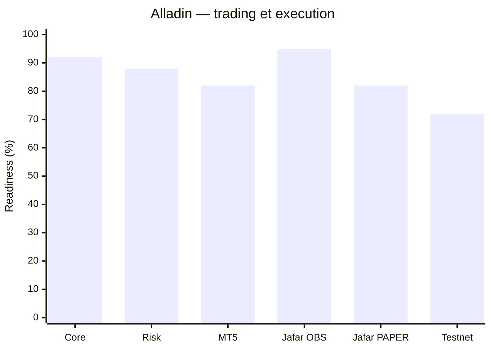
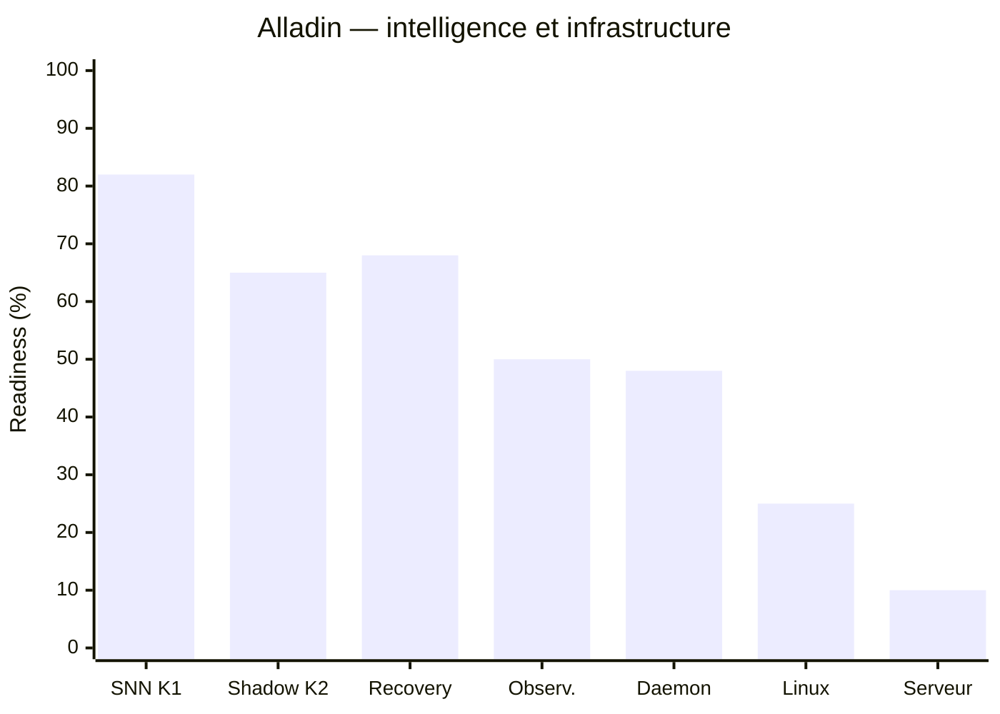

# ALLADIN — État d'avancement vers l'autonomie

**Date de référence :** 2026-10-05  
**Branche :** `main`  
**HEAD vérifié :** `347c6f1` — `feat: Jafar PAPER engine, Testnet adapter, execution chain, reconciliation, CLI`  
**Dernière validation connue :** **833 tests passed, 3 skipped**

> Ce document est un tableau de bord de progression. Le code et les tests restent la source de vérité pour ce qui est réellement implémenté. Les pourcentages ci-dessous sont des **indicateurs de readiness**, pas une mesure mathématique du nombre de lignes de code réalisées.

---

## 1. Résumé exécutif

Alladin n'est plus au stade de prototype architectural. Le socle principal est largement implémenté : orchestration, journalisation, risque, lifecycle d'ordres, replay, outcomes, workspaces Alladin/Jafar, cockpit, Jafar OBSERVE/PAPER, adapter Binance Testnet, réconciliation au redémarrage et fondations SNN-X.

La prochaine cible réaliste n'est **pas** le LIVE. La cible est :

> **Alladin/Jafar autonome 24/7 sur serveur en OBSERVE/PAPER, capable de survivre aux redémarrages, de se réconcilier, de journaliser son état et de s'arrêter en sécurité.**

Une fois cette cible atteinte, le serveur peut devenir le laboratoire permanent pour les expériences SNN-X, le Shadow Brain et les validations TESTNET.

---

## 2. Progression actuelle

| Bloc | Readiness estimée | État vérifié | Reste principal |
|---|---:|---|---|
| Core Alladin / architecture | **92%** | Très avancé | stabilisation et dette mineure |
| Journal / event sourcing | **92%** | Implémenté | enrichissement et observabilité |
| Risk Engine / garde-fous | **88%** | Implémenté et testé | recette endurance + cas réels |
| Opportunity / orchestration | **82%** | Implémenté | qualité de sélection et validation terrain |
| MT5 / Forex lifecycle | **82%** | 5 actions + idempotence implémentées | recette DEMO Windows réelle |
| Replay causal / archive | **86%** | Implémenté | provenance tick/bid/ask plus fine |
| Outcomes / Reward | **82%** | Implémenté | exploiter les outcomes pour apprentissage/promotion |
| Mission Control | **82%** | Fonctionnel | historique, santé runtime, alertes |
| Jafar OBSERVE | **95%** | Fonctionnel | endurance 24/7 |
| Jafar PAPER engine | **82%** | Implémenté : fills simulés, portefeuille, SL/TP, restore | valider boucle complète de génération → entrée → gestion → sortie sur longue durée |
| Jafar Order Lifecycle | **88%** | Implémenté | tests d'intégration exchange prolongés |
| Jafar restart reconciliation | **88%** | Implémenté, fail-closed | validation avec cas exchange réels |
| Binance Testnet adapter | **72%** | submit/query/cancel implémentés, garde URL stricte | recette réelle TESTNET + intégration runtime continue |
| Jafar Execution Service | **78%** | TESTNET/LIVE_GATED/LIVE chain implémentée | raccordement opérationnel et validation bout en bout |
| SNN K1 | **82%** | fondations LIF/encodeur/R-STDP présentes | calibration expérimentale + benchmarks |
| Shadow Brain K2 | **65%** | intégré passivement au flux Jafar | comparaison outcomes à grande échelle |
| FAST/SLOW K3 foundation | **45%** | frontière FAST/SLOW présente | boucle learning complète + critères de promotion |
| World Model | **20%** | décision/architecture | runtime expérimental |
| Dream Engine | **25%** | frontière slow/replay prévue | consolidation et candidats réellement entraînés |
| Crash recovery global | **68%** | forte base lifecycle/reconciliation | supervision processus + scénarios multi-services |
| Kill switches / fail-closed | **72%** | protections déjà nombreuses | health-based shutdown et règles serveur |
| Observabilité 24/7 | **50%** | logs/cockpit disponibles | heartbeat, métriques, alertes, watchdog |
| Daemon/service autonome | **48%** | runtime existe | superviseur, auto-restart, checkpoints, service OS |
| Déploiement Linux | **25%** | architecture compatible | packaging, systemd/Docker, secrets, backups |
| Serveur dédié | **10%** | non déployé | infrastructure + recette de déploiement |
| Autonomie OBSERVE/PAPER sur serveur | **~72%** | proche mais pas prête à être déclarée production-like | chemin critique ci-dessous |
| Autonomie LIVE fiable | **~35%** | volontairement bloquée | preuves statistiques + TESTNET/DEMO prolongés + autorisation explicite |


---

## 3. Graphes de progression

Pour éviter les libellés illisibles, la progression est séparée en deux vues.

### 3.1 Socle trading et exécution



### 3.2 Intelligence, résilience et infrastructure



### 3.3 Chemin critique vers le serveur


> **Readiness globale vers l'objectif serveur OBSERVE/PAPER : ~72 %.**  
> Le graphe représente l'état du code au HEAD de référence et ne remplace pas les validations d'endurance ou les recettes broker réelles.

---

## 4. Corrections par rapport aux anciennes estimations

Les estimations précédentes sous-évaluaient plusieurs blocs.

### Jafar PAPER

Ce n'est plus un simple squelette.

Le commit `347c6f1` ajoute notamment :

- `JafarPaperEngine` ;
- données Binance réelles avec exécution simulée ;
- slippage déterministe ;
- lifecycle `PROPOSED → FILLED` ;
- suivi cash, capital, PnL, drawdown et fees ;
- surveillance SL/TP ;
- restauration des positions au redémarrage ;
- commandes CLI `jafar positions`, `jafar open-orders`, `jafar reconcile`.

La question restante n'est donc plus « construire PAPER », mais **valider que la boucle autonome produit, gère et clôture correctement des trades pendant une période longue**.

### Binance TESTNET

L'adapter n'est plus seulement planifié.

`BinanceTestnetOrderClient` et la chaîne d'exécution Jafar existent avec :

- séparation stricte du domaine Testnet ;
- garde avant toute écriture ;
- `clientOrderId` préfixé `jfr-` ;
- submit/query/cancel ;
- aucun renvoi automatique après timeout ;
- passage en `PENDING_CONFIRMATION` quand l'état exchange est incertain.

Il reste surtout la **recette réelle TESTNET** et le raccordement opérationnel permanent.

### Réconciliation au restart

La réconciliation est désormais une capacité réelle.

`JafarRestartReconciler` traite notamment :

- ordre local absent de l'exchange ;
- ordre rempli pendant une interruption ;
- partial fill ;
- annulation/expiration ;
- réponse perdue ;
- état ambigu ;
- ordre présent sur l'exchange mais inconnu localement.

Le principe est fail-closed : en cas d'ambiguïté, le runtime ne doit pas improviser ni resoumettre.

### SNN-X

La documentation historique qui indique « zéro ligne de code SNN » est obsolète.

K1 existe et K2 est déjà intégré en Shadow Brain passif. La frontière FAST/SLOW est également présente. En revanche, **cela ne signifie pas que le SNN est validé comme meilleur trader** : il reste un système expérimental qui doit gagner le droit d'être promu à partir de résultats OOS et d'outcomes comparables.

---

## 5. Chemin critique avant serveur autonome

### Étape A — Valider PAPER sur longue durée

Objectif :

- génération d'opportunités ;
- ouverture simulée ;
- SL/TP ;
- gestion de position ;
- clôture ;
- PnL/fees ;
- persistence ;
- redémarrage ;
- aucune duplication.

**Sortie attendue :** plusieurs sessions longues reproductibles sans intervention manuelle.

### Étape B — Terminer la recette MT5 réelle

Le code du lifecycle Forex est déjà largement présent.

À valider depuis Windows/MT5 DEMO :

- ouverture ;
- MODIFY_STOP ;
- MODIFY_TARGET ;
- PARTIAL_CLOSE ;
- CLOSE ;
- restart sans double ordre ;
- reconciliation avec l'état réel du broker.

### Étape C — Runtime 24/7 robuste

Ajouter/valider :

- heartbeat ;
- watchdog ;
- restart automatique ;
- checkpoint ;
- stale-data detection ;
- reconnexion broker ;
- arrêt fail-closed ;
- gestion propre des interruptions réseau.

### Étape D — Observabilité serveur

Mission Control doit pouvoir montrer au minimum :

- état du runtime ;
- dernier heartbeat ;
- broker connecté/déconnecté ;
- dernière donnée marché ;
- dernière décision ;
- positions ;
- exposition ;
- PnL ;
- drawdown ;
- erreurs ;
- ordre en attente de confirmation ;
- état du Shadow Brain.

### Étape E — Déploiement Linux

Préparer :

- environnement reproductible ;
- secrets séparés du code ;
- stockage persistant ;
- migrations ;
- logs ;
- backup ;
- rotation ;
- service `systemd` ou conteneur ;
- auto-start après reboot ;
- health check.

**À la fin de cette étape : le PC personnel peut être éteint sans interrompre Alladin.**

---

## 6. Ce qui peut continuer après le déploiement serveur

Le serveur ne nécessite pas que toute la recherche soit terminée.

Les blocs suivants peuvent progresser pendant qu'Alladin fonctionne en OBSERVE/PAPER :

1. calibration SNN K1 ;
2. collecte d'outcomes Shadow Brain ;
3. comparaison Brain classique / SNN ;
4. K3 promotion gating ;
5. World Model ;
6. Dream Engine ;
7. Strategy Harvester ;
8. optimisation des features et régimes ;
9. expérimentations OOS.

Le serveur doit donc être vu comme **le laboratoire permanent d'Alladin**, pas comme la récompense obtenue seulement lorsque toute la recherche est terminée.

---

## 7. Conditions minimales pour déclarer « Alladin tourne de ses propres ailes »

La mention **AUTONOMOUS PAPER READY** ne doit être utilisée que si toutes les conditions suivantes sont vérifiées :

- [ ] runtime stable pendant une fenêtre prolongée sans intervention ;
- [ ] restart du service sans duplication d'ordre ;
- [ ] reconciliation cohérente après restart ;
- [ ] PAPER ouvre et ferme réellement des positions simulées ;
- [ ] SL/TP et management de position validés ;
- [ ] heartbeat et watchdog opérationnels ;
- [ ] stale market data détectée ;
- [ ] broker/API outage gérée sans comportement dangereux ;
- [ ] kill switch testé ;
- [ ] logs et journal permettent de reconstruire un incident ;
- [ ] Mission Control montre l'état opérationnel ;
- [ ] service démarre automatiquement après reboot serveur ;
- [ ] secrets non stockés dans Git ;
- [ ] backup/persistence testés ;
- [ ] suite software verte ;
- [ ] recette d'acceptation serveur documentée.

---

## 8. Ce que « autonome » ne veut pas dire

Autonome ne signifie pas :

- trader en LIVE sans validation ;
- promouvoir automatiquement un modèle expérimental ;
- supprimer les garde-fous ;
- faire confiance à un SNN parce qu'il est complexe ;
- considérer un backtest positif comme une preuve de rentabilité future ;
- resoumettre un ordre quand l'état exchange est inconnu.

Autonome signifie :

> **observer, décider, exécuter dans le mode autorisé, gérer ses positions, persister son état, détecter ses erreurs, se réconcilier après interruption et s'arrêter en sécurité sans dépendre d'un humain devant le terminal.**

---

## 9. Priorité de travail recommandée

Ordre de priorité actuel :

```text
1. PAPER endurance / boucle complète
        ↓
2. Recette MT5 lifecycle
        ↓
3. Heartbeat + watchdog + crash recovery global
        ↓
4. Observabilité Mission Control
        ↓
5. Packaging Linux / systemd
        ↓
6. Déploiement serveur OBSERVE/PAPER
        ↓
7. TESTNET prolongé
        ↓
8. SNN-X K2/K3 + apprentissage expérimental continu
        ↓
9. LIVE_GATED uniquement après preuves suffisantes
```

---

## 10. Indicateur global

À partir du code présent au HEAD `347c6f1` :

- **Socle logiciel général : ~88–90 %**
- **Jafar OBSERVE/PAPER : ~82–90 %**
- **Résilience/reconciliation : ~70–85 %**
- **SNN-X opérationnel expérimental : ~55–65 %**
- **Infrastructure 24/7 : ~45–50 %**
- **Déploiement serveur : ~25 %**
- **Objectif "Alladin autonome OBSERVE/PAPER sur serveur" : ~72 %**
- **Objectif "LIVE suffisamment prouvé pour être envisagé" : ~35 %**

Le principal risque n'est plus de manquer de fonctionnalités. Le principal risque est désormais de **confondre fonctionnalité implémentée avec fonctionnalité validée en conditions longues et réelles**.

---

## 11. Règle de mise à jour de ce document

À chaque jalon significatif :

1. mettre à jour le HEAD de référence ;
2. mettre à jour le nombre de tests ;
3. ne monter un pourcentage que si une capacité a été codée **et/ou validée** ;
4. distinguer `IMPLEMENTED`, `TESTED`, `VALIDATED` et `DEPLOYED` ;
5. ne jamais marquer LIVE comme prêt sur la seule base de tests unitaires.

Ce fichier sert de tableau de bord humain. Pour les détails d'architecture et les décisions, consulter :

- `docs/HANDOFF.md`
- `docs/IMPLEMENTATION_PLAN.md`
- `docs/DECISIONS/`
- `docs/SNN/`
