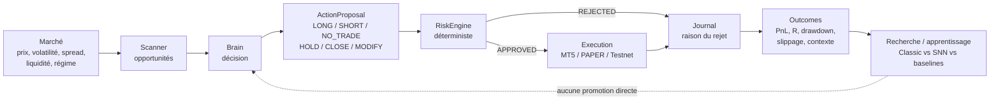
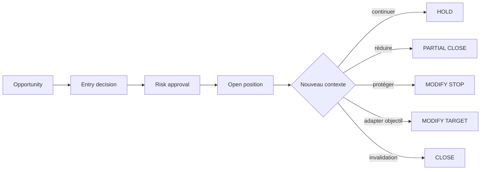
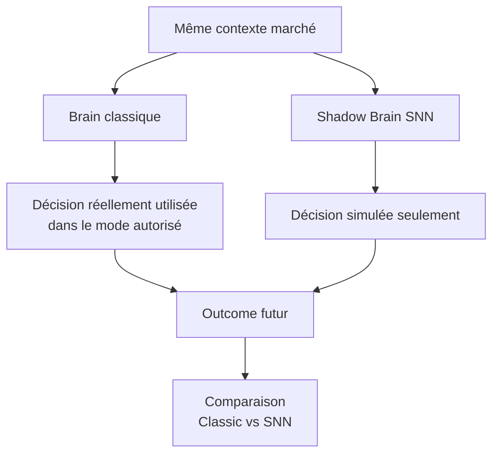

# ALLADIN — Trader Overview

**Public cible :** trader discrétionnaire, trader systématique, quant, développeur trading, risk manager  
**Date :** 2026-10-05  
**Statut :** document de présentation fonctionnelle — le code et les tests restent la source de vérité

---

## 1. Alladin en une phrase

**Alladin est un système de trading expérimental autonome qui sépare volontairement trois choses : comprendre le marché, proposer une action, puis décider si cette action a réellement le droit d'être exécutée.**

L'objectif n'est pas de construire un simple bot qui applique une règle du type « RSI < 30 = BUY ».

Le projet cherche à construire un environnement où plusieurs approches de trading peuvent :

- observer le même marché ;
- produire des décisions comparables ;
- être testées avec les mêmes coûts et les mêmes données ;
- être jugées sur leurs résultats réels ;
- être refusées par un moteur de risque indépendant ;
- apprendre ou être remplacées sans compromettre la sécurité du capital.

Alladin couvre principalement le **Forex / CFD via MetaTrader 5**.

**Jafar** est le workspace crypto du même écosystème, orienté **Binance Spot**, avec OBSERVE, PAPER, TESTNET et des modes LIVE volontairement verrouillés.

---

## 2. Ce que nous essayons réellement de construire

Le projet repose sur une idée simple :

> Une bonne stratégie de trading ne suffit pas. Il faut aussi savoir quand elle est pertinente, combien risquer, quand ne pas trader, comment gérer la position, comment survivre à une panne, et comment prouver qu'une amélioration est réelle.

Alladin est donc composé de plusieurs couches indépendantes.



Le point important pour un trader : **le cerveau ne contrôle pas directement le risque final ni le broker**.

Même si une stratégie ou un modèle est extrêmement confiant, il doit passer par le RiskEngine.

---

## 3. La philosophie de trading

Alladin ne repose pas sur une stratégie unique censée fonctionner partout.

Notre hypothèse est l'inverse :

> **le comportement qui fonctionne dépend du régime de marché.**

Un breakout peut être excellent dans une phase d'expansion de volatilité et désastreux dans un marché sans direction.

Une stratégie de mean reversion peut très bien fonctionner dans un range et devenir dangereuse lorsqu'un nouveau trend commence.

La question centrale n'est donc pas :

> « Quelle est la meilleure stratégie ? »

mais :

> **« Quel comportement semble cohérent avec le marché actuel, avec quel niveau d'incertitude, et est-ce que le risque justifie de prendre le trade ? »**

Cela conduit à une approche **multi-stratégies + détection de régime + sélection/routing + contrôle du risque**.

---

## 4. Les stratégies utilisées aujourd'hui

### 4.1 Trend / Time-Series Momentum

Hypothèse :

> un mouvement suffisamment établi peut continuer pendant une certaine période.

Signal conceptuel :

```math
s_t = sign(P_t / P_{t-L} - 1)
```

Une variante tient compte de la volatilité :

```math
z_t = \frac{r_{t,L}}{\sigma_{t,L}}
```

Interprétation :

- momentum positif suffisamment fort → candidat LONG ;
- momentum négatif suffisamment fort → candidat SHORT ;
- signal insuffisant → NO_TRADE.

**Forces :**
- simple ;
- interprétable ;
- cohérent avec des marchés directionnels ;
- bonne baseline pour comparer des modèles plus complexes.

**Faiblesses :**
- whipsaw en range ;
- sensibilité aux coûts ;
- entrées parfois tardives ;
- corrélations entre instruments en période de stress.

---

### 4.2 Breakout / Volatility Expansion

Hypothèse :

> une rupture d'une zone de compression peut annoncer le début d'un mouvement plus important.

Exemple causal :

```math
upper_t = max(High_{t-L:t-1})
```

```math
lower_t = min(Low_{t-L:t-1})
```

Puis :

```text
prix > upper + buffer  -> candidat LONG
prix < lower - buffer  -> candidat SHORT
sinon                  -> NO_TRADE
```

Le buffer peut être lié à l'ATR et au spread.

**Forces :**
- cherche les phases d'expansion ;
- naturellement compatible avec une logique événementielle ;
- complémentaire du trend.

**Faiblesses :**
- faux breakouts ;
- slippage ;
- spreads élevés pendant les annonces ;
- risque de sur-optimiser les niveaux.

---

### 4.3 Range / Mean Reversion

Hypothèse :

> dans certains régimes, un prix très éloigné de son état local peut revenir vers une zone d'équilibre.

Exemple :

```math
z_t = \frac{P_t - \mu_t}{\sigma_t}
```

Conceptuellement :

```text
z très positif -> candidat SHORT
z très négatif -> candidat LONG
z proche de 0  -> FLAT / sortie
```

**Forces :**
- très différente du trend ;
- utile dans les marchés latéraux ;
- permet au système de tester deux hypothèses opposées sur le même marché.

**Danger majeur :**

Un prix qui semble « trop haut » ou « trop bas » n'est pas forcément en anomalie.

Il peut simplement être en train d'entrer dans **un nouveau régime**.

Alladin n'autorise donc jamais une logique de type « moyenner la perte jusqu'à avoir raison » sans contrainte déterministe.

---

## 5. Les familles de stratégies en recherche

Le dossier `docs/STRATEGIES/` contient aussi des familles qui ne doivent pas être confondues avec des stratégies déjà validées en production.

| Famille | Idée | Rôle envisagé |
|---|---|---|
| Time-Series Momentum | persistance directionnelle | baseline / signal principal |
| Breakout | expansion après compression | événement / changement de régime |
| Mean Reversion | retour vers un état local | comportement de range |
| Pairs / Stat Arb | divergence relative entre actifs liés | signal relatif |
| FX Carry | différentiel de rendement | contexte lent FX |
| Multi-Factor Regime | combiner plusieurs états du marché | routing / contexte |

Ces stratégies sont des **hypothèses expérimentales**, pas des promesses de rendement.

---

## 6. Le vrai cœur de la stratégie : le régime de marché

Alladin cherche d'abord à réduire le nombre de mauvais trades avant de chercher à multiplier les entrées.

Le scanner observe notamment :

- direction ;
- volatilité ;
- spread ;
- qualité des données ;
- liquidité ;
- ATR ;
- contexte du symbole ;
- opportunités candidates ;
- régime de marché.

Le système peut donc rejeter une opportunité avant même qu'elle arrive au cerveau.

Exemple réel de logique :

```text
GBPJPY
setup potentiel détecté

spread / ATR = 0.27
limite = 0.15

=> FILTERED
=> aucun trade
```

Pour nous, **NO_TRADE est une vraie décision**.

Un système qui sait rester hors du marché lorsqu'il n'a pas d'avantage clair peut être plus robuste qu'un système forcé de produire plusieurs trades par heure.

---

## 7. Le Brain classique

Le Brain reçoit un contexte de marché déjà préparé.

Il peut produire :

- `LONG`
- `SHORT`
- `NO_TRADE`
- `HOLD`
- `CLOSE`
- `MODIFY_STOP`
- `MODIFY_TARGET`
- `PARTIAL_CLOSE`

Une décision contient notamment :

- instrument ;
- stratégie ;
- version de stratégie ;
- régime ;
- confiance ;
- SL ;
- TP ;
- risque demandé ;
- raisons ;
- sources ;
- identifiant unique.

Le Brain **ne choisit pas directement le lot**.

Il peut demander par exemple :

> « Je souhaite risquer 4,5 % du capital de travail sur cette idée. »

Puis le RiskEngine calcule le volume réellement autorisé.

---

## 8. Le modèle de risque

La sécurité est volontairement séparée de l'intelligence.

Le RiskEngine est déterministe : il n'apprend pas et ne peut pas être convaincu par un LLM ou par le SNN.

### Capital de travail

Le modèle actuel utilise :

```text
working_capital = equity × 10 %
max_trade_risk  = working_capital × 8 %
```

Ce plafond correspond donc au maximum à :

```text
0,8 % de l'equity
```

Exemple sur une equity de 100 000 :

| Élément | Valeur |
|---|---:|
| Equity | 100 000 |
| Capital de travail | 10 000 |
| Risque maximal théorique par trade | 800 |

Ce **800 n'est pas le risque par défaut**.

C'est un plafond.

Le système peut risquer beaucoup moins.

---

## 9. Comment le lot est calculé

Le volume dépend du stop réel et des caractéristiques du symbole.

```text
loss_per_lot =
    |entry - stop_loss|
    / tick_size
    × tick_value_loss

volume =
    risk_amount / loss_per_lot
```

Puis le volume est :

- arrondi vers le bas ;
- borné par les limites broker ;
- recalculé selon la marge ;
- refusé s'il force le système à dépasser le risque autorisé.

Donc deux trades avec le même signal peuvent avoir des volumes très différents si leurs stops ou leurs instruments sont différents.

---

## 10. Ce que le RiskEngine vérifie avant une entrée

Une proposition peut être refusée pour de nombreuses raisons :

- compte non autorisé ;
- mode incorrect ;
- kill switch ;
- run invalide ;
- trading désactivé ;
- SL absent ;
- SL/TP incohérent ;
- distance minimale broker ;
- prix ayant trop dérivé depuis la décision ;
- spread trop élevé ;
- mauvais ratio gain/risque ;
- risque par trade trop important ;
- trop de positions ;
- exposition globale trop forte ;
- exposition excessive sur une devise ;
- corrélation ;
- marge insuffisante ;
- limite de perte quotidienne ;
- limite de perte totale ;
- état challenge incompatible.

Autrement dit :

> **un bon signal ne crée jamais automatiquement un ordre.**

---

## 11. Gestion des positions

Alladin ne s'arrête pas à l'entrée.

Le modèle d'action permet également :

```text
HOLD
CLOSE
PARTIAL_CLOSE
MODIFY_STOP
MODIFY_TARGET
```

Cela permet de travailler sur une stratégie complète :



L'objectif à terme est qu'une position soit gérée en fonction de son contexte et non simplement abandonnée au SL/TP initial.

---

## 12. Alladin et Jafar

### Alladin

Orientation principale :

- Forex / instruments MT5 ;
- gestion du challenge ;
- lifecycle de position ;
- validation DEMO ;
- stratégies classiques et SNN.

### Jafar

Orientation :

- crypto ;
- Binance Spot ;
- univers dynamique ;
- fonctionnement continu 24/7.

Modes :

```text
OBSERVE
   ↓
PAPER
   ↓
TESTNET
   ↓
LIVE_GATED
   ↓
LIVE
```

Il est volontairement impossible de sauter librement les étapes dangereuses.

---

## 13. Jafar PAPER

PAPER utilise les données de marché mais simule l'exécution.

Le moteur gère déjà :

- capital ;
- cash ;
- positions ;
- frais ;
- slippage déterministe ;
- PnL réalisé ;
- PnL latent ;
- drawdown ;
- SL ;
- TP ;
- restauration après redémarrage.

Le but n'est pas de fabriquer un joli backtest.

Le but est d'observer comment le système se comporte **cycle après cycle comme s'il était en marché**, sans exposer de capital réel.

---

## 14. TESTNET et réconciliation

L'un des problèmes les plus dangereux d'un bot de trading est le suivant :

> le programme envoie un ordre, perd la connexion et ne sait plus si l'ordre a été exécuté.

La mauvaise solution serait de renvoyer immédiatement l'ordre.

Alladin/Jafar fait l'inverse.

En cas d'incertitude :

```text
SUBMITTING
    ↓
timeout / réponse perdue
    ↓
PENDING_CONFIRMATION
    ↓
query exchange
    ↓
reconciliation
```

**Jamais de resoumission automatique tant que l'état réel n'est pas connu.**

Après un restart, le système compare :

- lifecycle local ;
- journal ;
- ordres exchange ;
- fills ;
- positions/balances disponibles.

S'il existe une ambiguïté :

> **FAIL CLOSED**

Il s'arrête au lieu d'improviser.

---

## 15. Pourquoi nous construisons un SNN

La partie la plus expérimentale d'Alladin est le **Spiking Neural Network**.

L'objectif n'est pas simplement de remplacer un réseau neuronal classique par quelque chose de plus exotique.

Nous cherchons à tester une idée précise :

> un système neuronal impulsionnel inspiré d'un connectome biologique peut-il apprendre à distinguer les contextes où trend, breakout, reversion ou NO_TRADE sont pertinents, tout en restant enfermé dans un système de risque déterministe ?

L'architecture de recherche s'inspire du connectome **MaleCNS de la drosophile**.

Mais il faut être clair :

**la drosophile n'est pas supposée connaître le Bitcoin.**

Le connectome constitue une structure expérimentale.

Il doit battre des baselines simples pour mériter d'être conservé.

---

## 16. Comment le marché entre dans le SNN

Des variables marché peuvent être transformées en événements/spikes :

- momentum ;
- volatilité ;
- accélération ;
- breakout ;
- spread ;
- volume ;
- microstructure ;
- divergence ;
- surprise ;
- changement de régime ;
- état du portefeuille.

Exemple conceptuel :

```text
fort breakout       -> burst de spikes
volatilité faible   -> activité sensorielle réduite
spread anormal      -> canal de risque activé
momentum persistant -> activité répétée
```

Le réseau traite alors un flux temporel, plutôt qu'une simple ligne de features statiques.

---

## 17. R-STDP : apprendre après les conséquences

La plasticité expérimentale utilise notamment du **Reward-modulated STDP**.

Schématiquement :

```text
perception
    ↓
activité neuronale
    ↓
décision simulée
    ↓
conséquence observée
    ↓
reward / douleur / surprise
    ↓
mise à jour des connexions
```

Mais le reward ne se résume pas à :

```text
PnL positif = bien
PnL négatif = mal
```

À terme il peut prendre en compte :

- rendement ;
- drawdown ;
- risque pris ;
- respect du plan ;
- slippage ;
- qualité du timing ;
- coût ;
- opportunité ratée ;
- stabilité.

La politique de reward est versionnée pour que les expériences restent auditables.

---

## 18. Shadow Brain

Le SNN n'a pas besoin de contrôler les trades pour apprendre.

C'est le rôle du **Shadow Brain**.



Exemple :

```text
EURUSD à 10:00

Classic Brain : LONG
Shadow SNN    : NO_TRADE

3 heures plus tard :
trade Classic = -1R

=> le système conserve aussi l'information :
   "le SNN aurait évité ce trade"
```

L'inverse est également conservé.

Cela permet d'évaluer le cerveau sans lui donner immédiatement le droit de toucher au compte.

---

## 19. FAST loop et SLOW loop

Nous séparons deux vitesses.

### FAST

Pendant le marché :

- observer ;
- encoder ;
- inférer ;
- proposer ;
- journaliser.

Le chemin doit être rapide et stable.

### SLOW

Hors chemin critique :

- rejouer ;
- analyser les outcomes ;
- apprendre ;
- comparer des variantes ;
- entraîner des candidats ;
- effectuer des ablations ;
- rejeter les modèles faibles.

Cette séparation évite qu'un apprentissage coûteux ou instable modifie brutalement le comportement en pleine exécution.

---

## 20. Dream Engine

Le Dream Engine est encore une cible expérimentale.

L'idée :

> laisser le système rejouer des situations passées et tester des décisions alternatives sans risquer de capital.

Exemple :

```text
historique :
Alladin a pris LONG → -0,8R

Dream:
- NO_TRADE ?
- SHORT ?
- entrée plus tard ?
- stop différent ?
- autre stratégie ?
```

Ces simulations ne modifient pas directement le système actif.

Elles produisent des **candidats** qui doivent ensuite être validés.

---

## 21. Comment nous jugeons une stratégie

Nous refusons la logique :

> « elle a gagné quelques trades donc elle est bonne ».

Une stratégie ou un cerveau doit être comparé sur :

- expectancy ;
- distribution des R ;
- drawdown ;
- hit rate ;
- payoff ratio ;
- coûts ;
- slippage ;
- stabilité par régime ;
- stabilité par instrument ;
- résultats out-of-sample ;
- sensibilité aux paramètres ;
- robustesse entre seeds pour les modèles stochastiques ;
- dépendance ou non à quelques trades extrêmes.

Le même :

- dataset ;
- split ;
- coût ;
- horizon ;
- RiskEngine ;

doit être utilisé pour comparer deux candidats.

---

## 22. TRAIN, VALIDATION et OOS

Pour éviter de fabriquer involontairement une stratégie adaptée au passé :

```text
TRAIN
  ↓
construction / apprentissage

VALIDATION
  ↓
sélection / réglage limité

OUT-OF-SAMPLE
  ↓
évaluation finale
```

Une fois l'OOS utilisé comme feedback de réglage, ce n'est plus réellement de l'OOS.

C'est pourquoi Alladin cherche à conserver la provenance des expériences et des versions.

---

## 23. Pourquoi les baselines sont importantes

Un SNN de milliers de neurones n'a aucun intérêt s'il ne fait pas mieux qu'une règle très simple.

Nous voulons notamment comparer :

1. stratégie unique ;
2. routing fixe ;
3. modèle statistique simple ;
4. Brain classique ;
5. SNN sans plasticité ;
6. SNN avec R-STDP ;
7. variantes / ablations.

Si une moyenne mobile fait mieux avec dix fois moins de complexité :

> **la moyenne mobile gagne.**

La complexité doit mériter son coût.

---

## 24. Le journal comme boîte noire

Chaque décision importante doit pouvoir être reconstruite.

Le système journalise notamment :

- cycle ;
- opportunité ;
- stratégie/version ;
- décision ;
- raison ;
- résultat du risque ;
- ordre ;
- broker ;
- état de position ;
- outcome ;
- PnL ;
- slippage ;
- événements de reconciliation.

L'objectif est de pouvoir répondre après un trade :

> Pourquoi ce trade a-t-il été pris ?

et non seulement :

> Le trade a perdu.

---

## 25. Exemple complet d'un trade

Supposons que le scanner détecte EURUSD.

### Étape 1 — Marché

```text
EURUSD
régime : TREND
spread acceptable
volatilité acceptable
data quality : OK
```

### Étape 2 — Opportunité

Le moteur crée :

```text
OPP-XXXX
symbol = EURUSD
strategies candidates = TREND
```

### Étape 3 — Brain

Proposition :

```text
LONG EURUSD
strategy = TREND-01
confidence = 0.73
SL = 1.1750
TP = 1.1840
requested risk = 4 % du working capital
```

### Étape 4 — RiskEngine

Le système vérifie :

```text
account       OK
challenge     OK
daily loss    OK
spread        OK
RR            OK
currency risk OK
margin        OK
SL            OK
```

Puis calcule lui-même le volume.

### Étape 5 — Execution

L'ordre reçoit un identifiant Alladin.

Le système vérifie ensuite que la position existe réellement chez le broker.

### Étape 6 — Management

Plus tard :

```text
HOLD
ou
MODIFY_STOP
ou
PARTIAL_CLOSE
ou
CLOSE
```

### Étape 7 — Outcome

Après fermeture :

```text
PnL
R
MAE
MFE
spread
slippage
fees
durée
régime
strategy version
brain version
```

sont conservés.

### Étape 8 — Recherche

Le système peut comparer :

```text
Classic Brain : LONG  → +0.7R
Shadow Brain  : LONG  → confiance 0.61
Trend baseline        → LONG
Mean Reversion        → NO_TRADE
```

Cette donnée devient utile pour les expériences futures.

---

## 26. Ce qui distingue Alladin d'un Expert Advisor classique

| EA classique | Alladin |
|---|---|
| stratégie souvent monolithique | architecture multi-stratégies |
| signal → ordre | signal → proposal → risk → execution |
| logique de risque liée à la stratégie | RiskEngine indépendant |
| logs techniques | journal causal/auditable |
| restart parfois fragile | reconciliation explicite |
| une logique active | Brain + Shadow Brain |
| optimisation de paramètres | protocole expérimental + OOS |
| peu de NO_TRADE explicite | NO_TRADE comme décision de premier rang |
| apprentissage éventuel directement actif | apprentissage séparé de l'exécution |

---

## 27. Ce que le projet ne prétend pas aujourd'hui

Nous ne prétendons pas que :

- Alladin est rentable en LIVE ;
- le SNN bat le marché ;
- la drosophile apporte déjà un edge ;
- les stratégies actuelles sont optimales ;
- les backtests prouvent les performances futures ;
- le système est prêt à gérer du capital sans surveillance ;
- un résultat PAPER équivaut à une exécution réelle.

Aujourd'hui, nous pouvons plutôt dire :

> **le laboratoire, les garde-fous, la collecte de preuves et une grande partie du moteur d'exécution existent ; la prochaine étape est de produire suffisamment de données propres pour juger la stratégie plutôt que de la vendre avant de l'avoir prouvée.**

---

## 28. Où en est le projet

Pour l'état chiffré et le chemin vers l'autonomie :

- `docs/AUTONOMY_PROGRESS.md`

Pour l'architecture :

- `docs/ARCHITECTURE.md`
- `docs/HANDOFF.md`

Pour les stratégies :

- `docs/STRATEGIES/`

Pour le SNN :

- `docs/SNN/ALLADIN_SNN_BIBLE.md`
- `docs/SNN/FLY_BRAIN_FUNCTION.md`

Pour les décisions d'architecture :

- `docs/DECISIONS/`

---

## 29. Ce que nous voulons pouvoir montrer à un trader demain

Le prochain niveau de maturité est de pouvoir présenter non seulement l'architecture, mais un historique observable :

```text
Nombre d'opportunités analysées
Nombre de NO_TRADE
Nombre de trades
Win rate
Expectancy
Profit factor
Average R
Maximum drawdown
MAE / MFE
Slippage moyen
Performance par stratégie
Performance par régime
Performance par instrument
Classic Brain vs Shadow Brain
```

Lorsque ces chiffres seront issus de sessions PAPER/TESTNET suffisamment longues, ce document pourra être accompagné d'un véritable **Trader Report**.

---

## 30. Résumé pour un trader

Si tu ne devais retenir que huit idées :

1. **Alladin ne cherche pas une stratégie magique.** Il cherche à reconnaître le contexte où chaque comportement est pertinent.
2. **Trend, breakout et mean reversion sont actuellement les comportements classiques de base.**
3. **NO_TRADE est une décision normale**, pas un échec du système.
4. **Le RiskEngine a le dernier mot** et reste indépendant du cerveau.
5. **Le volume est calculé à partir du risque et du stop**, pas choisi arbitrairement par l'IA.
6. **Chaque trade doit être reconstructible** grâce au journal, au lifecycle et au replay.
7. **Le SNN apprend d'abord dans l'ombre** et doit battre les baselines avant d'obtenir davantage de responsabilités.
8. **Le but immédiat est l'autonomie OBSERVE/PAPER 24/7**, pas le passage précipité en LIVE.

> Le projet ne cherche donc pas seulement à répondre à « BUY ou SELL ? ».
>
> Il cherche à répondre à une question plus difficile :
>
> **« Dans cet état du marché, avons-nous réellement un avantage suffisant pour prendre du risque — et si oui, combien, comment, et avec quelle preuve ? »**
